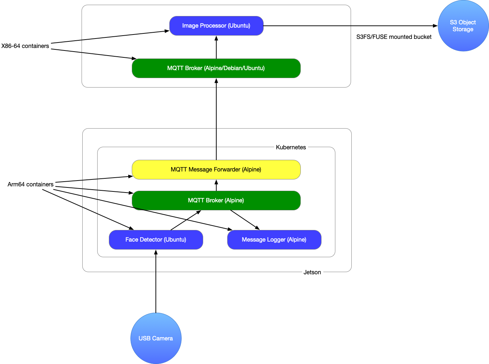
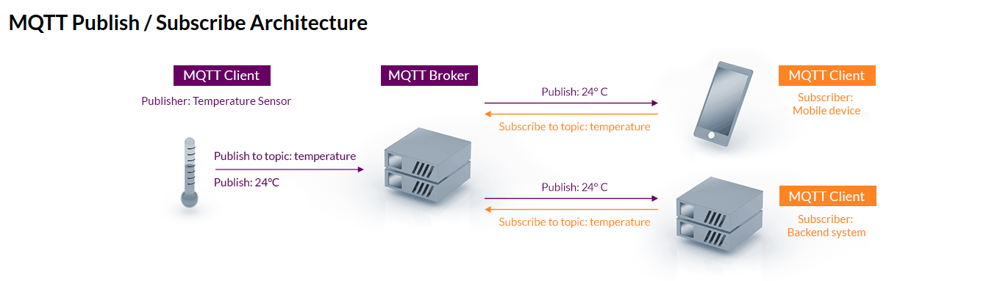

# W251 - Summmer 2021 - Homework 3
### Section 2: Alice Hua

This repository contains my homework 3 **Containers, Kubernetes, and IoT/Edge** for course W251 - Deep Learning in the Cloud and at the Edge at the UC Berkeley School of Information. 
The following is the directory structure of this application. There are two main components, the edge and the cloud. The edge device is the Jetson NX, the IoT device is the USB webcam. The cloud component is a VM in AWS.
The application is deployed using Kubernetes (K3s)
```
+-- cloud
|   +-- deploy_script.sh
|   +-- broker
|       +-- Dockerfile
|	+-- docker_script.sh
|       +-- mosquitto_deployment.yaml
|       +-- mosquittoService.yaml  
|   +-- processor
|       +-- Dockerfile
|	+-- docker_script.sh
|	+-- processor_deployment.yaml
|	+-- processor.py
+-- edge
|   +-- deploy_script.sh
|   +-- mosquitto_deployment.yaml
|   +-- other_deployments.yaml
|   +-- mosquittoService.yaml
|   +-- broker
|       +-- Dockerfile
|   +-- detector
|	+-- Dockerfile
|       +-- docker_script.sh
|	+-- haarcascade_frontalface_default.xml
|       +-- cam.py
|   +-- logger 
|       +-- Dockerfile
|       +-- docker_script.sh
|       +-- logger.py
|   +-- forwarder
|      +-- Dockerfile
|      +-- docker_script.sh
|      +-- forwarder.py    
```

### How it works - MQTT and QoS
This end-to-end containerized application works by getting captured faces in a video stream coming from the Iot device and transmit them to the cloud via a messaging protocol MQTT, and store these captures in an object storage S3 bucket.
on the edge, we have the USB camera sending video stream to our face detector container (a MQTT client)  where I used OpenCV to scan for faces. The faces are cropped and grayed out, and serialized into bytes to be send (publish to the topic) to the MQTT broker. The message logger acts as a listener (another MQTT client) that listens to the topic where the messages are published to. The forwarder (our third MQTT client on the edge) receives the messages by subscribing to the same topic, and connect to the remote broker to send (publish) the messages to the cloud. The connection edge to cloud is made in the forwarder via the public IPv4 address and the exposed NodePort from the VM.   
On the cloud, we have 2 containers on a lightweight VM (t2.medium with 2vCPUs and 4gb RAM), the MQTT broker and the image processor (a MQTT client). The broker receives the messages and made it available to the processor where the bytes are converted back to pictures and saved in a S3 bucket. Note, to spin up and connect these containers in practice, we use Kubernetes Deployment and Service explained in the **Steps** section.  
Below is the application workflow, notice the Arm64 and X86-64 architectures are denoting the Jetson and VM respectively.  


MQTT is a lightweight messaging protocol for Internet of Things (IoT). The MQTT system contains brokers and clients, where clients can be either publishers or subscribers or both. There can be a one to many or many to one setup where there are multiple clients and one broker.
Publishers send data to the broker in the form of MQTT packets, which consist of a topic and a payload. The broker then distributes the data to subscribers based on the topics they have subscribed to (see references for MQTT). This message protocol has the benefits of efficient communication between machines because they only need to etablish connection with the broker instead of connecting directly to each other. There is also a benefit of scalability where MQTT can scale to connect with millions of IoT devices. It also has different levels of message delivery called Quality of Service.  

Three Quality of Service (QoS): match network reliability & application logic  
0 - At most once (best effort delivery, no guarantee of deliver)  
1 - At least once (guarantees delivery of at least one time to receiver, could deliver multiple times)  
2 - Exactly one (highest level, guarantees that each message is received on once, safest and slowest quality of service level)  

For this application, I used QoS 0. As explained above, the broker will deliver the message once with no guarantee nor confirmation. This makes sense because we are only doing a class assignment where only our faces are detected and there is no need to have every capture of my face. 
I can see in instances where security is an issue (i.e theft monitoring system), then we would use a higher level of delivery service.   


### Assumptions & Requirements
You need to set up a few things for this application to connect:
1. You have a functioning USB webcam + Jetson NX 
2. You have installed k3s & docker on your Jetson and on your VM
3. You have created an S3 bucket and made it publicly assessible 
4. You have created IAM role with AmazonS3FullAccess policy

### Steps 
* Note: There are more than one way to approach this, these steps are what I've taken for this assignment. 
1. Do the necessary setup in the **Assumptions and Requirement**. Below are some commands that are necessary for this step:

```
# For Docker
curl -fsSL get.docker.com | sh
docker login
sudo groupadd docker
sudo usermod -aG docker $USER
docker system prune (optional for when run out of space on VM)
refer to docker_script.sh for build commands

# For Kubernetes K3s 
# install
mkdir $HOME/.kube/
curl -sfL https://get.k3s.io | sh -s - --docker --write-kubeconfig-mode 644 --write-kubeconfig $HOME/.kube/config

# uninstall
/usr/local/bin/k3s-uninstall.sh

# kubectl commands to deploy - describe - delete - expose 
refer to deploy_script.sh in this repo
```

2. Build images via multiple Dockerfiles, you should have image each container: detector, logger, forwarder, broker, processor
3. Write codes for the face detector, the logger and forwarder and the processor components. They are going to be similar to each other since they're using a MQTT python module (paho-client) to subscribe and publish messages.
4. Write scripts to automate the docker image building process and Kubernetes deployments. 
5. The firing order is: bring up from the cloud side, broker, processor, then edge side, forwarder, logger and finally detector.    
* Importance: for this application, aside from Ingress and Load Balancers which were not used here, I used a fixed NodePort that was exposed on the cloud to get the external Kubernetes network on edge to connect another Kubernetes network on the cloud. The command lives in the ``deploy_script.sh``

### Example Images 
- Ny S3 bucket: https://alicehua-w251-hw3.s3.amazonaws.com/
- My sample image: https://alicehua-w251-hw3.s3.amazonaws.com/face10684.png  
<p align="center">
  
</p>
 
### Take Aways
- Learn how to build Docker images from scratch
- Learn how Kubernetes orchestrate pods (where containers live) via Deployments, communicate with each other through ports via Services
- Learn how to use kubectl-cli to interact + debug pods
- Learn what MQTT is, its subscriber/publisher architecture
- Learn how the edge (Jetson) communicates (i.e inbound security) with cloud (AWS EC2)  

### Reference

- MQTT
	- https://mqtt.org/
	- http://event.moxa.com/newsletter/connection/2019/10/feat_02.html
	- http://www.steves-internet-guide.com/client-connections-python-mqtt/
	- https://www.eclipse.org/paho/index.php?page=clients/python/docs/index.php

- Kubernetes
	- https://www.youtube.com/watch?v=X48VuDVv0do
	- https://medium.com/@texasdave2/troubleshoot-kubectl-connection-refused-6f5445a396ed
	- https://blog.getambassador.io/kubernetes-ingress-nodeport-load-balancers-and-ingress-controllers-6e29f1c44f2d
- 
- S3
	- https://boto3.amazonaws.com/v1/documentation/api/latest/guide/s3-examples.html
	- https://stackoverflow.com/questions/40336918/how-to-write-a-file-or-data-to-an-s3-object-using-boto3

